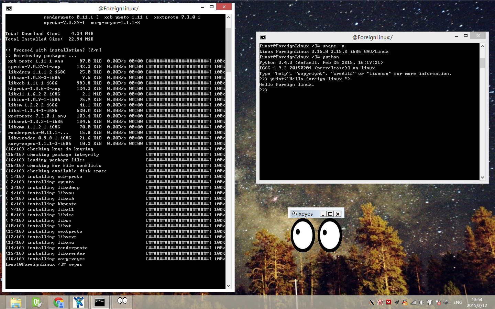

# flinux

- 페이지 링크: https://github.com/wishstudio/flinux

Windows 환경에서 Linux를 써보는 방법엔 여러가지가 있습니다. VMware나 Virtual Box 등의 가상머신 위에 자신의 입맛에 맞는 리눅스를 설치해 이용할 수도 있고, 가상머신에 의해 시스템 리소스를 너무 많이 잡아먹는 것이 싫고, GUI 환경 없이 쉘 터미널 상에서 리눅스 어플리케이션을 사용하고 싶은 사람들을 위해 Cygwin이라는 툴도 있습니다. 

이번에 소개해 드릴 Foreign Linux는 Cygwin을 사용하는 사람들의 또 다른 대안이 될 수 있을 것 같습니다. Foreign Linux는 Cygwin과 비슷한 기능을 제공하지만, 차이점을 말씀드리자면 윈도우 환경에서 리눅스 바이너리 실행파일 번역기이자, 리눅스의 시스템콜 인터페이스를 에뮬레이터입니다.(뭐;;;뭔말이지?)

사실 스크린샷을 봐도 크게 와닿지가 않으실 텐데요. ^^;;; 조금 오래 캡쳐를 들여다 보시면 윈도우의 CMD 창에서 리눅스가 구동되는 것을 보실 수 있습니다.

이것이 Cygwin과의 차이점인데요. 사실 Foreign Linux와 Cygwin이 지향하는 바는 같습니다. 하지만 그 지향점을 위해서 구현하는 방식이 다른데요. Cygwin은 임베디드 시스템을 개발에서 이기종의 아키텍쳐에서 프로그램이 동작할 수 있게 크로스 컴파일을 하는 것처럼, windows 기반의 api를 가지고 linux의 api set을 제공합니다. 그래서 Cygwin에서 linux 어플리케이션을 구동하기 위해서는 Cygwin toolchain에 의해 소스코드가 리컴파일을 거쳐야 하지요. 하지만 foreign linux는 그런 리컴파일 과정 없이 네이티브 리눅스 어플리케이션을 바로 구동할 수 있습니다.

일단 여기까지의 소개만 들어도 꽤 난이도가 높은 개발로 보여지는데요. 현재까지의 개발 결과물을 통해 bash, vim같은 기본 유틸이나 gcc같은 개발환경을 바로 사용해 볼 수 있습니다. 하지만 file 접근 권한이나, 프로세스 관리, 멀티 쓰레딩과 관련해서는 아직 개발해야할 부분이 있어서, 해당 기능을 사용하는 어플리케이션은 잘 동작하지 않을 수 있다고 하네요. 조금만 더 기다리면 더 완성도 높은 결과물을 기대해볼 수 있지 않을까 싶네요. 
