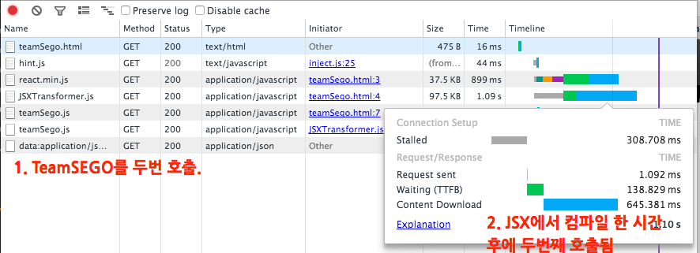
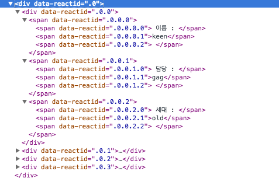
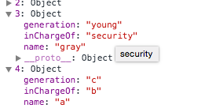

# React.js Deep Dive!
## 1화 (초간단 ReactJs application 만들어 보기)


1. 리스팅

  일단 TeamSEGO listing을 하는 페이지를 간단하게 만들어 볼까요?


  ### 변수 정의
  아래와 같이 TeamSEGO 를 변수로 건의합니다.
  ```
   TeamSEGO

   var segoMember = [{name:"keen",inChargeOf :"gag", generation:"old"},{name:"steve", inChargeOf : "study",generation:"old"},{name:"jump",inChargeOf :"zzal", generation:"young"},{name:"gray",inChargeOf :"security", generation:"young"}];
  ```

  ### HTML
  html 은 정말 간단하게 정의해 봅시다. 모든걸 Javascript에서 다 만든다! 라는 느낌으로! -> 장기적으로 노드와 연결해서 Isomorphic Javascript 를 구현해 볼지도 모르는 거니까요!
  ```
  HTML

  <html>
    <head>
      <script src="https://cdnjs.cloudflare.com/ajax/libs/react/0.12.2/react.min.js"></script>
      <script src="https://cdnjs.cloudflare.com/ajax/libs/react/0.12.2/JSXTransformer.js"></script>
    </head>
    <body>
      <script  type="text/jsx" src="/scripts/teamSego.js"></script>
      <!-- 당연히 teamSego.js 를 만들겠죠? -->
    </body>
  </html>
  ```

  ### Dummy

  일단은 dummy 파일을 한번 찍어 볼까요? 그래도 처음 배워보는 리액트인데, 헬로월드 정도는 찍어줘야.( 작성자 대강 개발 연차가 나오는 발언인가요? )

  [jsfiddle 소스 확인](https://jsfiddle.net/ehrudxo/kcx4pbr1/8/)
  ```
  var Dummy = React.createClass({
      render: function() {
          return (
              <div>
               Hello Wordl! I'm keen of TeamSEGO
              </div>
          );
      }
  });
  React.render(<Dummy/>, document.body);
  ```
  주의 할 점! 처음에 dummy 로 클래스 명을 찍었더니 Type ERROR, exception 이 뜨는군요. camelcase 로 가나 봅니다. 처음 뜬 에러는 caught Error: Minified exception occurred;  이었는데 Dummy로 해결한 뒤에 다시 그 에러를 보려고 들어가니 Type ERROR로 뜨는 걸로 봐서는 JSX변환을 메모리 영역에 올리는 일들을 하는 거 같습니다.(오호!)

  ```Hello Wordl! I'm keen of TeamSEGO```

  훌륭하게 잘 찍히는 군요. (Word l 은 다분히 의도적입니다.)
  작은 따옴표(\') 를 집어 넣어도 잘 표시되는게 흥미롭네요.(당연한가요?)

  ### DOM의 변화
  요소 검사 혹은 브라우저 Inspector 로 내부를 들여다 보면 이렇게 변해져 있습니다.
  ```
  <body>
    <div data-reactid=".0">Hello Wordl! Im keen of TeamSEGO</div>
  </body>
  ```
  javascript 영역이 HTML로 변환되어 들어갔네요.

  흥미로운 이미지 하나 보고 들어가실까요?
  

  1. 네트워크 탭을 확인해 보면 teamSEGO.js가 두번 호출됩니다.
  2. JSXTransformer가 initiator 가 되어서 Content 다운로드 시간 이후에 두번째 TeamSEGO.js 가 호출 되는 걸로 봐서는 js를 렌더링하는 시간(혹은 컴파일) 이후에 일련의 일들이 일어나게 됩니다.

  그리고 이걸 보내주는 쪽도 Transformer.js 의 아래쪽 에서 xhr .send 쪽이군요.

  ```
  Transformer.js

  function load(url, successCallback, errorCallback) {
  var xhr;
  xhr = window.ActiveXObject ? new window.ActiveXObject('Microsoft.XMLHTTP')
                             : new XMLHttpRequest();

  // async, however scripts will be executed in the order they are in the
  // DOM to mirror normal script loading.
  xhr.open('GET', url, true);
  if ('overrideMimeType' in xhr) {
    xhr.overrideMimeType('text/plain');
  }
  xhr.onreadystatechange = function() {
    if (xhr.readyState === 4) {
      if (xhr.status === 0 || xhr.status === 200) {
        successCallback(xhr.responseText);
      } else {
        errorCallback();
        throw new Error("Could not load " + url);
      }
    }
  };
  return xhr.send(null);
}
  ```
  JSX 변환에 대해서는 차차 2화에서 더 다루도록 하겠습니다.

  ### 그냥 뿌려보기

  일단 segoMember를 뿌려봅시다. 그 이후에 감이 올 듯합니다.

  [jsfiddle 소스 확인](https://jsfiddle.net/ehrudxo/kcx4pbr1/9/)

  ```
  teamSego.js

  var SegoDiv = React.createClass({
    render: function() {
      return (
          <div>
           {this.props.member}
          </div>
      );
    }
  });
  React.render(<SegoDiv member={segoMember}/>, document.body);
  ```

  무척이나 심플한 소스입니다. 설명을 드리자면 SegoDiv라는 ReactClass를 만드는데
  ``` <SegoDiv member={segoMember}/> ```
  라고 해 놓고 reder 메쏘드를 통해 실행이 되면
  SegoDiv 클래스의 props 공간에 member 라는 변수로 할당이 되는구나.
  라고 이해하시면 됩니다.
  props는 나중에 event를 다룰 때 state와 그 사용법을 잘 이해하셔서 사용하셔야 합니다.

  그리고 이 결과를 DOM으로 확인해 보면 크롬에서는 다음과 같이 만들어 집니다.

  ```
  <div data-reactid=".0">
    <span data-reactid=".0.0:$name:0">keen</span>
    <span data-reactid=".0.0:$inChargeOf:0">gag</span>
    <span data-reactid=".0.0:$generation:0">old</span>
    <span data-reactid=".0.1:$name:0">steve</span>
    <span data-reactid=".0.1:$inChargeOf:0">study</span>
    <span data-reactid=".0.1:$generation:0">old</span>
    <span data-reactid=".0.2:$name:0">jump</span>
    <span data-reactid=".0.2:$inChargeOf:0">zzal</span>
    <span data-reactid=".0.2:$generation:0">young</span>
    <span data-reactid=".0.3:$name:0">gray</span>
    <span data-reactid=".0.3:$inChargeOf:0">security</span>
    <span data-reactid=".0.3:$generation:0">young</span>
  </div>
  ```

  데이타를  어떻게 찍어낼지 지정해 주지 않고 던져도 대강 찍어낼 정도로 똑똑한데, 제가 원하는 결과는 아니네요.

  Iteration을 돌면서 사용자 별로 구분을 짓는 방법은 없을까요?

  물론 있습니다. 코드를 약간 바꿔봅시다.

  [jsfiddle 소스 확인](https://jsfiddle.net/ehrudxo/kcx4pbr1/10/)

  ```

  var SegoDiv = React.createClass({
    render : function() {
      var members=[];
      this.props.member.forEach(function( member ){
        members.push( <div>
                      <span> 이름 : {member.name} </span>
                      <span> 담당 : {member.inChargeOf} </span>
                      <span> 세대 : {member.generation} </span>
                      </div>
                    );
      }.bind(this));
      return (
          <div>
            {members}
          </div>
      );
    }
  });
  React.render(<SegoDiv member={segoMember}/>, document.body);

  ```

  그냥 this.props.member 를 출력하도록 맡기던 거를

  ``` this.props.member.forEach ```
  배열을 forEach 함수를 통해 members 배열에 새롭게 조직해서 작성해 줍니다.

  그랬더니 제가 원했던 결과가 나왔네요.

  

  브라우저에서 결과를 한번 확인해 볼까요?

  

  재밌는 거는 각 어휘가 끝나는 단계 별로 잘라서 <span/> 태그를 넣어주네요.

  ```
  members.push( <div>
                    이름 : {member.name}
                    , 담당 : {member.inChargeOf}
                    , 세대 : {member.generation}
                    </div>
                  );
  ```
  로 바꿔주는게 제가 원하는 거에 더 가까운 결과를 가져다 주겠네요.

2. 입력

  입력을 위해서는 두가지의 저장 공간을 더 알아야 합니다. 먼저 언급했던 중요한 저장 공간은 this.props라는 공간입니다. 이 공간이 하는 역할은 javascript 가 DOM의 scope 내에 값을 할당하고 다시 쓸 수 있는 공간이라면, 지금 언급할 공간은 refs 와 state라는 공간입니다. 이름만으로 대강 감이 오실 수 있다고 생각하는데요.
  ### form 작성

  먼저 form 을 만들어봅시다.

  [jsfiddle 소스 확인](https://jsfiddle.net/ehrudxo/kcx4pbr1/11/)  

  ```
  var SegoForm = React.createClass({
    render : function(){
      return(
        <div>
          <form>
            <input type="text" placeholder="이름" ref="name" />
            <input type="text" placeholder="담당" ref="inChargeOf" />
            <input type="text" placeholder="세대" ref="generation" />
            <input type="submit" value="Post" />
          </form>
        </div>
      );
    }  
  });

  ```

  form 쪽에는 일반적인 input text들을 나열했습니다. 여기서 표준 HTML이 아닌 녀석은 ref 가 되겠네요.
  네, 지금은 그 얘기를 하고 싶습니다.

  저렇게 ref="" 하고 영역의 이름을 지정해 주면, form으로 만들어 준 HTML과 javascript 의 scope 간에 데이타를 서로 공유하겠다는 이야기이구요.
  scope 내의 공간은 refs 가 됩니다. ( 여러분들이 저 영역을 사용할 때는  ```this.refs.someName``` 의 형태로 사용되어 지겠네요).

  ### refs 영역 소개

  그럼 이제, form 을 제출 할 때에 대한 event를 생각해 봅시다.

  당연히 onSubmit 이벤트를 이용할 생각이구요. 그럴 경우에 함수를 지정해 줍니다.
  함수 이름은 handleSubmit 으로 하겠습니다.

  그럼 코드는 다음과 같이 변경되겠네요.

  ```

  var SegoForm = React.createClass({
    handleSubmit: function(e) {
      e.preventDefault();
      var name = this.refs.name.getDOMNode().value.trim();
      var inChargeOf = this.refs.inChargeOf.getDOMNode().value.trim();
      var generation = this.refs.generation.getDOMNode().value.trim();
      console.log(name, inChargeOf, generation);
    },
    render : function(){
      return(
        <div>
          <form onSubmit={this.handleSubmit}>
            <input type="text" placeholder="이름" ref="name" />
            <input type="text" placeholder="담당" ref="inChargeOf" />
            <input type="text" placeholder="세대" ref="generation" />
            <input type="submit" value="Post" />
          </form>
        </div>
      );
    }
  });

  ```

  저장을 하고 실행해 보면 form에 작성하시는 글이 자연스럽게 여러분 브라우저의 콘솔에 출력이 되는 걸 확인할 수 있습니다.

  자, 그러면 정말 중요한 부분인데, form -> div로 data가 자연스레 변경되어야 하지 않을까요?

  그럼 SegoDiv 클래스와 SegoForm 클래스가 어떤 식으로든 데이타를 주고 받아야 할 텐데, 그건 어떻게 이루어 지나요?

  그것에 대해서 지금부터 설명하겠습니다.

  ### 클래스간 인터페이스 설계

  이 부분을 설명하는 게 참 흥미진진하고 재밌는 부분인데요, javascript를 잘 아시는 분들은 잘 따라오시리라 생각하고 그냥 죽 적겠습니다.
  모르셔도, 패턴이라 이해하시고 그냥 사용하시다 보면 이해가 되리라 생각됩니다.

  Javascrpt는 기본적으로 callback 함수를 함수의 매개변수로 던질 수 있습니다. 그래서 이벤트가 실행 될때 그 callback 함수를 호출하는 패턴을 참으로 많이 이용합니다.
  그 패턴을 기억하시면서 아래의 코드를 봐 주세요.

  ```

  var SegoDiv = React.createClass({
    formChanged : function(members){
      console.log(members);
    },
    render : function() {
      var members=[];
      this.props.member.forEach(function( member ){
        members.push( <div>
                      이름 : {member.name}
                      , 담당 : {member.inChargeOf}
                      , 세대 : {member.generation}
                      </div>
                    );
      }.bind(this));
      return (
        <div>
          <SegoForm onFormChange={this.formChanged} memebers = {this.props.member}/>
          <div>
            {members}
          </div>
        </div>
      );
    }
  });

  ```

  아까 작성한 함수에서 formChanged 가 추가가 되었네요. 그리고 SegoForm을 콜 할때 onFormChange 와 members를 지정해 주죠.

  이 의미는
    1. SegoForm 클래스의 props 변수에 onFormChange 라는 변수 공간을 할당하고 SegoDiv의 formChanged 함수를 콜백함수로 넘긴다.
    2. SegoForm 클래스의 props 변수에 memebers 라는 변수 공간을SegoDiv의 member 를 넘긴다
  로 이해하시면 되겠습니다.

  그러면, 당연히 받는 SegoForm 클래스에서 확인해 봐야겠네요.

  [jsfiddle 소스 확인](https://jsfiddle.net/ehrudxo/kcx4pbr1/12/)  

  ```
  var SegoForm = React.createClass({
    handleSubmit: function(e) {
      e.preventDefault();
      var name = this.refs.name.getDOMNode().value.trim();
      var inChargeOf = this.refs.inChargeOf.getDOMNode().value.trim();
      var generation = this.refs.generation.getDOMNode().value.trim();
      if (!name || !inChargeOf|| !generation) {
        console.log("fill the blank");
        return;
      }
      this.props.memebers.push({name:name,inChargeOf :inChargeOf, generation:generation});
      this.props.onFormChange(this.props.memebers);
      this.refs.name.getDOMNode().value = '';
      this.refs.inChargeOf.getDOMNode().value = '';
      this.refs.generation.getDOMNode().value = '';
    },
    render : function(){
      return(
        <div>
          <form onSubmit={this.handleSubmit}>
            <input type="text" placeholder="이름" ref="name" />
            <input type="text" placeholder="담당" ref="inChargeOf" />
            <input type="text" placeholder="세대" ref="generation" />
            <input type="submit" value="Post" />
          </form>
        </div>
      );
    }
  });

  ```
  위와 같이 클래스를 변경하고

  이름에 a,담당에 b, 세대에 c 값을 입력하면

  

  콘솔에서 SegoDiv의 변경된 값이 훌륭하게 찍혀서 반영이 되는 것을 확인할 수 있습니다.

  

  하지만 정작 DOM은 바뀌지 않죠.

  이제 DOM의 변경을 위해 state 영역을 살펴볼 차례 입니다.

  ### state 영역

  사실 DOM을 추가하기 위해서는 하나의 메쏘드만 더 호출해 주면 됩니다.

  SegoDiv 클래스의 formChanged 함수에

  ``` this.setState({}); ```

  한 줄만 추가 하면 실제 데이타의 값이 반영된 DOM을 다시 rendering 하게 해 줍니다.

  여기서 우리가 주목할 부분이 setState! 그렇죠. state가 바뀌면! DOM을 rendering 한다.


3. 검색

  간단하게만 살펴보고 가려고 했는데, 상당히 길어졌네요. state 영역을 잠깐 언급을 했습니다.
  props와 state 의 차이점을 처음에는 이해가 안되었는데, 문서를 조금 뒤져보니
  props 는 immutable 이라고 하는 문구들이 나오네요.

  그런데! 제가 위에 만든 예제로는 props 에 값을 add 했을 때에 값이 변하는 걸로 봐서는 정확하게는 이해는 안되는데
  어쨌든 state 는 refs 와 연동해 값이 변경되는 영역, props는 고유한 메모리 영역으로 판단하시면 될 듯합니다.

  일단 검색을 달아보겠습니다.

  ```
  SegoDiv 의 redering 영역
  <div>
    <SegoForm
    onFormChange={this.formChanged}
    members={this.props.members}
    />
    <div>
      {members}
    </div>
    <SegoSearch onSearch={this.onSearch}/>
  </div>
  ```

  SegoSearch라는 클래스를 지정하고 onSearch 라는 메쏘드를 바인딩 해 두었습니다.

  당연히 메쏘드도 추가해 두어야겠죠

  ```

  onSearch: function( name ){
    if(!name) name="";
    this.setState({
      nameFilter: name
    });
  },

  ```

  자, 이제 SegoSearch라는 클래스를 작성해야죠.

  ```
  var SegoSearch = React.createClass({
    handleChange: function(e) {
      this.props.onSearch( this.refs.name.getDOMNode().value );
    },
    render : function(){
      return(
        <div>
          <form>
            이름으로 찾기 : <input
            type="text"
            placeholder="이름"
            onChange = {this.handleChange}
            value={this.props.name}
            ref="name" />
          </form>
        </div>
      );
    }
  });
  ```
  onChange를 주목하시면 타이핑을 할 때마다 그 값을 읽어서 콜백함수로 들어온 onSearch 를 동작 시키는데
  그 매개변수로 인풋의 value값을 집어넣는 역할을 하고 있습니다.

  자 그려면 아래와 같은 그림이 나옵니다.

  

  하지만 정작 이름으로 찾기를 눌러봐도 아무런 변화가 안 일어 날 겁니다.

  왜냐하면 이전 소스에서 props 에 배열로 셋팅해 두었기 때문이죠.

  자 그러면 reder 소스를 다음과 같이 바꿔보죠

  ```
  SegoDiv 의 render 부분

  if(this.state.member && this.state.member.length > 0){
    this.state.member.forEach(function( member ){
      if ( member.name.indexOf(this.state.nameFilter) === -1 ) {
          return;
      }
      members.push( <div>
                    이름 : {member.name}
                    , 담당 : {member.inChargeOf}
                    , 세대 : {member.generation}
                    </div>
                  );
    }.bind(this));
  }
  ```
  아래와 같이 render 부분을 바꾸고 나면 다음과 같이 훌륭하게 검색이 됩니다.

  

  [소스보기 :js ](https://github.com/TeamSEGO/react-sample-project/blob/master/scripts/teamSego.js)

  [소스보기 :html ](https://github.com/TeamSEGO/react-sample-project/blob/master/teamSego.html)

  일단 초간단 만들기는 이렇게 마무리하고 JSX 트랜스폼을 다음에 다뤄보도록 하겠습니다.
  
  [다음](deep-dive-reactJs-02.md)
